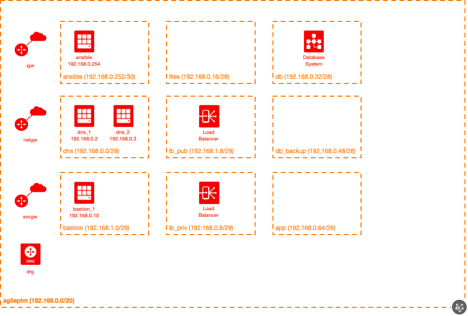
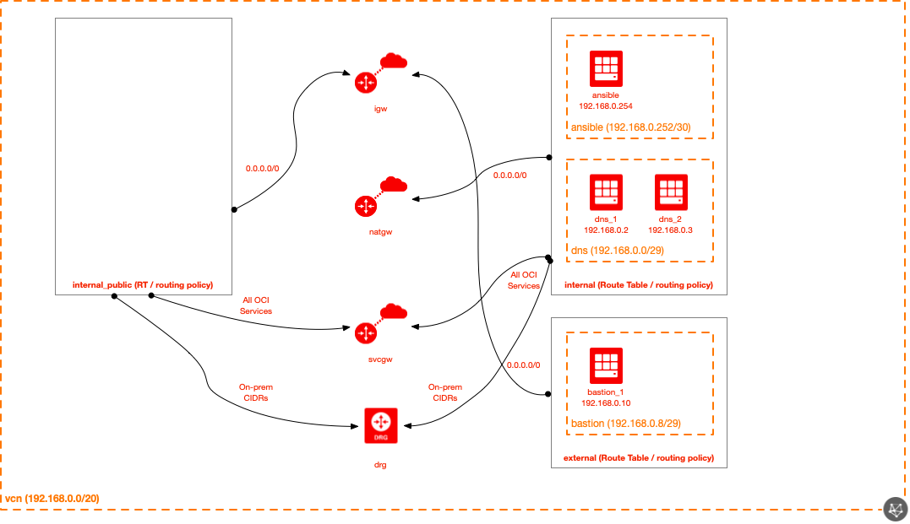
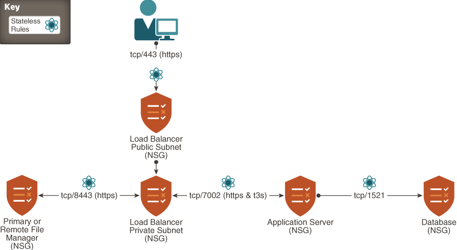
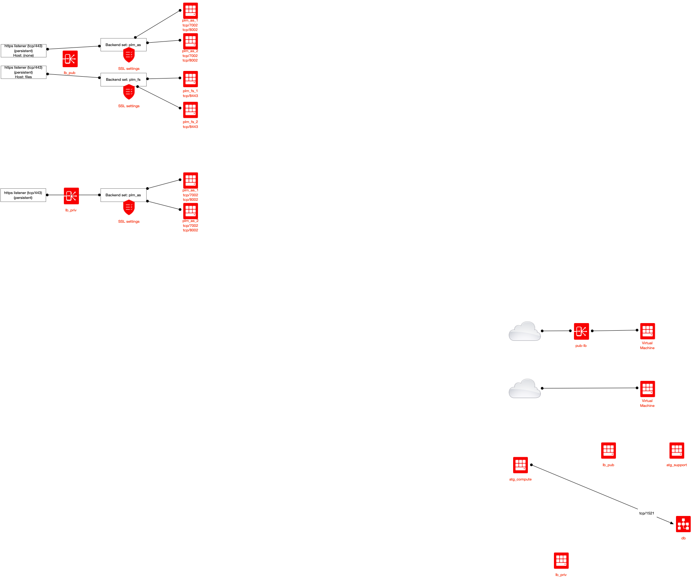
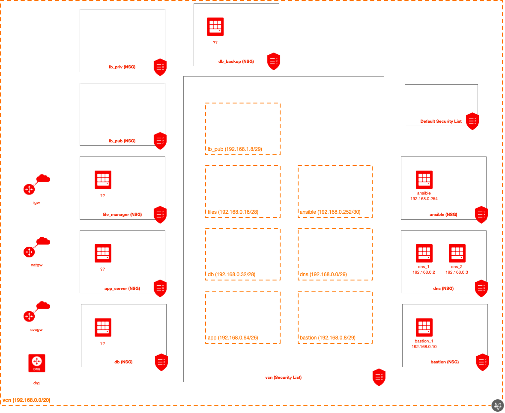
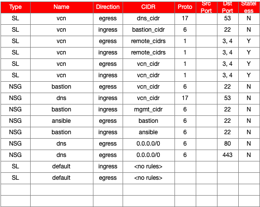

# Oracle Cloud Infrastructure Agile PLM Module for Terraform

## Introduction

This module provides a way to easily and quickly deploy Agile PLM in a new Oracle Cloud Infrastructure (OCI) environment.

## Solution

This Agile PLM module uses the following modules (with potentially other modules being used in addition by these modules):

| Resource                | Created by Default? |
| ----------------------- | ------------------- |
| Enterprise Base module  | Yes                 |
| Compute module          | Yes                 |
| Block Volumes           | Yes                 |
| Subnet module           | Yes                 |
| Network Security module | Yes                 |
| LB module               | Yes                 |

The following resources are created by this module:

* VCN
* Subnets
* Security List and rules (VCN-wide)
* NSGs (and rules)
* LBs
* Compute instances (optional number)
* DBsystem (optional)
* Bastion(optional), Ansible Control Machine(optional) and Hybrid DNS(optional) (all included courtesy of the Enterprise Base module)

## Diagrams

### Topology
Here's a quick snapshot into the default topology created by this module:



### Logical
Here's a diagram of the logical topology:



Here's a diagram of the data flows in the topology:



Here's a diagram of the LB flows in the topology:



### Security Policy
Here are the NSG(s) created by this module (by default):



Here's the default security policy that is created by this module:



## Resource-specific inputs

### Module

| Attribute                     | Data Type    | Required | Default Value | Valid Values                                                       | Description                                                                                                                                                                                                                                                                                                                                                              |
| ----------------------------- | ------------ | -------- | ------------- | ------------------------------------------------------------------ | ------------------------------------------------------------------------------------------------------------------------------------------------------------------------------------------------------------------------------------------------------------------------------------------------------------------------------------------------------------------------ |
| default\_compartment\_id      | string       | yes      | none          | string of the compartment OCID                                     | This is the default OCID that will be used when creating objects (unless overridden for any specific object).  This needs to be the OCID of a pre-existing compartment (it will not create the compartment.                                                                                                                                                              |
| default\_defined\_tags        | map(string)  | no       | {}            | Any map of tag names and values that is acceptable to the OCI API. | If any Defined Tags are set here, unless overwritten at the resource level, will be applied to all resources created by this module.                                                                                                                                                                                                                                     |
| default\_freeform\_tags       | map(string)  | no       | {}            | Any map of tag names and values that is acceptable to the OCI API. | If any Freeform Tags are set here, unless overwritten at the resource level, will be applied to all resources created by this module.                                                                                                                                                                                                                                    |
| default\_ssh\_auth\_keys      | list(string) | no       | []            | Any list of public (authorized) SSH keys.                          | The different authorized keys that are used (unless otherwise indicated on compute instances).                                                                                                                                                                                                                                                                           |
| default\_img\_id              | string       | no       | null          | OCID of compute instance image.                                    | If this is provided, it can be used as the default image OCID for resources created (unless otherwise specified at the resource level).                                                                                                                                                                                                                                  |
| default\_img\_name            | string       | no       | null          | Name of compute instance image.                                    | If this is provided, it can be used as the default image to be used for resources created (unless otherwise specified at the resource level).  The name can be obtained from https://docs.cloud.oracle.com/iaas/images/.  By providing a name (rather than an OCID), the module looks up the OCID (by the name) automatically.                                           |
| default\_mkp\_img\_name       | string       | no       | null          | Name of marketplace compute instance image.                        | The generic OCI mkt image name to be used across all provisioned Agile PLM instances(as and fm), except: DBCS, bastion, DNS and ansible. Image name and version must both be provided toghether or must both be null. They have the lowest priority in determining whio will be the image to be used, after the source_id with priority 1 and image_name with priority 2 |
| default\_mkp\_img\_version    | string       | no       | null          | Name of marketplace compute instance image.                        | The generic OCI mkt image name to be used across all provisioned Agile PLM instances(as and fm), except: DBCS, bastion, DNS and ansible. Image name and version must both be provided toghether or must both be null. They have the lowest priority in determining whio will be the image to be used, after the source_id with priority 1 and image_name with priority 2 |
| ssh\_private\_key             | string       | yes      | none          | Path and filename of the private key.                              | The filename to read for the private key to use when connecting to the bastion (and other systems).                                                                                                                                                                                                                                                                      |
| on\_prem\_cidrs               | list(string) | no       | []            | List of CIDR strings.                                              | If there are CIDRs that should be routed towards the DRG to connect to other networks (on-prem, etc) via FastConnect and/or VPN, provide the CIDRs here.  This paramter not only controls route rules (pointing these CIDRs towards the DRG), but also permits Path MTU Discovery (ICMP Type 3, Code 4) to/from these CIDRs (using the VCN-wide Security List).          |
| vcn                           | see below    | no       | see below     | see below                                                          | The different optional parameters for customizing the VCN.                                                                                                                                                                                                                                                                                                               |
| create\_igw                   | bool         | no       | true          | true/false                                                         | Whether or not a IGW should be created in the VCN.                                                                                                                                                                                                                                                                                                                       |
| create\_natgw                 | bool         | no       | true          | true/false                                                         | Whether or not a NAgile PLMW should be created in the VCN.                                                                                                                                                                                                                                                                                                               |
| create\_svcgw                 | bool         | no       | true          | true/false                                                         | Whether or not a SVCGW should be created in the VCN.                                                                                                                                                                                                                                                                                                                     |
| create\_drg                   | bool         | no       | true          | true/false                                                         | Whether or not a DRG should be created in the VCN.                                                                                                                                                                                                                                                                                                                       |
| create\_bastion               | bool         | no       | true          | true/false                                                         | Whether or not a bastion should be created.                                                                                                                                                                                                                                                                                                                              |
| bastion\_subnet               | see below    | no       | see below     | see below                                                          | The optional parameters for customizing the bastion subnet.                                                                                                                                                                                                                                                                                                              |
| bastion\_ssh\_src\_cidrs      | list(string) | no       | []            | List of CIDR strings.                                              | The different CIDRs that are permitted to SSH to the bastion.                                                                                                                                                                                                                                                                                                            |
| bastion\_public\_ip           | bool         | no       | true          | true / false                                                       | Whether or not the bastion should be given a public IP address.                                                                                                                                                                                                                                                                                                          |
| create\_dns                   | bool         | no       | true          | true/false                                                         | Whether or not hybrid DNS forwarders should be created.                                                                                                                                                                                                                                                                                                                  |
| dns\_subnet                   | see below    | no       | see below     | see below                                                          | Parameters for customizing the DNS subnet.                                                                                                                                                                                                                                                                                                                               |
| existing\_dns\_forwarder\_ips | list(string) | no       | null          | List of DNS forward IP addresses (as strings).                     | If DNS forwarders should not be created, but rather existing DNS forwarders be used, these can be specified.  This will result in the `internal` DHCP Options to be configured to use these forwarders.  These are used when `create_dns` is false (and this attribute is set to a valid value).                                                                         |
| dns\_namespace\_mappings      | see below    | no       | see below     | see below                                                          | Setting the mapping between DNS namespaces and the DNS forwarders that should be queried for each namespace.                                                                                                                                                                                                                                                             |
| reverse\_dns\_mappings        | see below    | no       | see below     | see below                                                          | Reverse DNS mapping entries.                                                                                                                                                                                                                                                                                                                                             |
| dns\_options                  | see below    | no       | see below     | see below                                                          | Optional attributes to customize the hybrid DNS resources.                                                                                                                                                                                                                                                                                                               |
| dns\_forwarder\_1             | see below    | no       | see below     | see below                                                          | Parameters for customizing DNS forwarder #1 that is created (if create\_compute is true).                                                                                                                                                                                                                                                                                |
| dns\_forwarder\_2             | see below    | no       | see below     | see below                                                          | Parameters for customizing DNS forwarder #2 that is created (if create\_compute is true).                                                                                                                                                                                                                                                                                |
| create\_ansible               | bool         | no       | true          | true/false                                                         | Whether or not a Ansible control machine should be created.                                                                                                                                                                                                                                                                                                              |
| ansible\_subnet               | see below    | no       | see below     | see below                                                          | The optional parameters for customizing the Ansible subnet.                                                                                                                                                                                                                                                                                                              |
| lb\_pub\_subnet               | see below    | no       | see below     | see below                                                          | The optional parameters for customizing the public LB subnet.                                                                                                                                                                                                                                                                                                            |
| lb\_pub                       | see below    | no       | see below     | see below                                                          | The optional parameters for customizing the public LB.                                                                                                                                                                                                                                                                                                                   |
| lb\_pub\_ssl\_plm\_as         | see below    | no       | see below     | see below                                                          | The optional parameters for customizing the public LB SSL settings for the PLM Application Servers.                                                                                                                                                                                                                                                                      |
| lb\_pub\_ssl\_plm\_fm         | see below    | no       | see below     | see below                                                          | The optional parameters for customizing the public LB SSL settings for the PLM File Managers.                                                                                                                                                                                                                                                                            |
| lb\_priv\_subnet              | see below    | no       | see below     | see below                                                          | The optional parameters for customizing the private LB subnet.                                                                                                                                                                                                                                                                                                           |
| lb\_priv                      | see below    | no       | see below     | see below                                                          | The optional parameters for customizing the private LB.                                                                                                                                                                                                                                                                                                                  |
| lb\_priv\_ssl\_plm\_as        | see below    | no       | see below     | see below                                                          | The optional parameters for customizing the private LB SSL settings for the PLM Application Servers.                                                                                                                                                                                                                                                                     |
| db\_subnet                    | see below    | no       | see below     | see below                                                          | The optional parameters for customizing the DB subnet.                                                                                                                                                                                                                                                                                                                   |
| db\_backup\_subnet            | see below    | no       | see below     | see below                                                          | The optional parameters for customizing the DB backup subnet.                                                                                                                                                                                                                                                                                                            |
| db\_options                   | see below    | yes      | see below     | see below                                                          | The optional parameters for customizing the DB.                                                                                                                                                                                                                                                                                                                          |
| app\_subnet                   | see below    | yes      | see below     | see below                                                          | The optional parameters for customizing the application server subnet.                                                                                                                                                                                                                                                                                                   |
| files\_subnet                 | see below    | yes      | see below     | see below                                                          | The optional parameters for customizing the file server subnet.                                                                                                                                                                                                                                                                                                          |
| plm\_admin\_cidrs             | list(string) | no       | []            | List of CIDR strings.                                              | The CIDRs that are permitted to access the PLM administration.                                                                                                                                                                                                                                                                                                           |
| remote\_file\_manager\_cidrs  | list(string) | no       | []            | List of CIDR strings.                                              | The CIDRs that the OCI-based File Managers are permitted to reach out to (access).                                                                                                                                                                                                                                                                                       |
| plm\_as\_options              | see below    | yes      | see below     | see below                                                          | The parameters used to customize the Application Servers.                                                                                                                                                                                                                                                                                                                |
| plm\_fm\_options              | see below    | yes      | see below     | see below                                                          | The parameters used to customize the File Managers.                                                                                                                                                                                                                                                                                                                      |

#### vcn

The `vcn` attribute is an optional map attribute.  Note that if this attribute is used, all keys/values must be specified (Terraform does not allow for default or optional map keys/values).  It has the following defined keys (and default values):

| Key        | Data Type | Default Value | Valid Values     | Description                 |
| ---------- | --------- | ------------- | ---------------- | --------------------------- |
| cidr       | string    | no            | "192.168.0.0/20" | Any valid CIDR in a string. | The CIDR that should be used for the VCN.  |
| dns\_label | string    | no            | "agile_plm"      | Any valid DNS label.        | This is the DNS label assigned to the VCN. |
| name       | string    | no            | "agile_plm"      | Any valid VCN name.         | The name that should be used for the VCN.  |


These options are largely a pass-through for the enterprise-base module.

Example:

```
module "agile_plm" {
  ... /snip - shortened for brevity...

  default_compartment_id  = var.default_compartment_id
  
  vcn                 = {
    cidr              = "10.0.0.0/20"
    dns_label         = "myplm"
    name              = "my_agile_PLM"
  }
}
```

The above example will configure the VCN to use a name of "my_agile_plm", with a DNS label of "myplm" and a CIDR of "10.0.0.0/20".

#### bastion_subnet

The `bastion_subnet` attribute is an optional map attribute.  Note that if this attribute is used, all keys/values must be specified (Terraform does not allow for default or optional map keys/values).  It has the following defined keys (and default values):

| Key        | Data Type | Default Value    | Valid Values            | Description                                             |
| ---------- | --------- | ---------------- | ----------------------- | ------------------------------------------------------- |
| cidr       | string    | "192.168.1.0/29" | String of a valid CIDR. | You may specify the CIDR to use for the bastion subnet. |
| dns\_label | string    | "bastion"        | Valid DNS name.         | Specify the DNS label to be used for the subnet.        |

Example:

```
module "agile_plm" {
  ... /snip - shortened for brevity...

  bastion_subnet     = {
    dns_label    = "jump"
    cidr         = "10.1.2.0/24"
  }
}
```

The above example will configure the bastion subnet to use a CIDR of *10.1.2.0/24*, with a DNS label of *jump*.

#### ansible_subnet

The `ansible_subnet` attribute is an optional map attribute.  Note that if this attribute is used, all keys/values must be specified (Terraform does not allow for default or optional map keys/values).  It has the following defined keys (and default values):

| Key        | Data Type | Default Value      | Valid Values            | Description                                             |
| ---------- | --------- | ------------------ | ----------------------- | ------------------------------------------------------- |
| cidr       | string    | "192.168.0.252/30" | String of a valid CIDR. | You may specify the CIDR to use for the Ansible subnet. |
| dns\_label | string    | "ansible"          | Valid DNS name.         | Specify the DNS label to be used for the subnet.        |

Example:

```
module "agile_plm" {
  ... /snip - shortened for brevity...

  ansible_subnet     = {
    dns_label    = "ansible"
    cidr         = "10.1.10.0/24"
  }
}
```

The above example will configure the ansible subnet to use a CIDR of *10.1.10.0/24* and a DNS label of *ansible*.

#### dns_subnet

The `dns_subnet` attribute is an optional map attribute.  Note that if this attribute is used, all keys/values must be specified (Terraform does not allow for default or optional map keys/values).  It has the following defined keys (and default values):

| Key        | Data Type | Default Value    | Valid Values    | Description                                      |
| ---------- | --------- | ---------------- | --------------- | ------------------------------------------------ |
| cidr       | string    | "192.168.0.0/29" | IPv4 CIDR       | Specify the IPv4 CIDR to be used for the Subnet. |
| dns\_label | string    | "dns"            | Valid DNS name. | Specify the DNS label to be used for the subnet. |

Example:

```
module "agile_plm" {
  ... /snip - shortened for brevity...

  dns_subnet     = {
    dns_label    = "dns"
    cidr         = "10.1.20.0/24"
  }
}
```

The above example will configure the DNS subnet to use a CIDR of *10.1.20.0/24*, with a DNS label of *dns*.

#### dns_forwarder_1

The `dns_forwarder_1` attribute is an optional map attribute that is used to configure attributes of the first DNS forwarder compute instance.  These are the instance-specific details that are only relevant to a this compute instance.  Note that if this attribute is used, all keys/values must be specified (Terraform does not allow for default or optional map keys/values).  It has the following defined keys (and default values):

| Key                 | Data Type | Default Value | Valid Values                                                             | Description                                                                                                                                                                                                                                                                                                                               |
| -------- -----------  | ------ ---------  | ---------- -------------  | ------------------- ------------------------------------------ -------------------- | ----------------------------------------------------------------------------------------------------- -------------------------------------------------------------------------------------------------------------------------------------------------------------------------- ------------------------------------------------------------------ |
| ad                   | number       | 0                         | The zero-indexed number of the desired AD. | Provide a number to indicate the AD you'd like the compute instance deployed to.  The number should be zero-indexed, meaning AD1 = 0, AD2 = 1, AD3 = 2, etc.                             |
| private\_ip | string       | null                   | null or any valid IP address string.             | If you desire to specify a specific static private IP address, provide the value here.  If you do not provide a value, the next available private IP address will be used. |

Example:

```
module "agile_plm" {
  ... /snip - shortened for brevity...

  dns_forwarder_1     = {
    ad                = 0
    private_ip        = "10.1.2.3"
  }
}
```

The above example will configure DNS forwarder #1 to have a private IP of *10.1.2.3*, residing in AD1.

#### dns_forwarder_2

The `dns_forwarder_2` attribute is an optional map attribute that is used to configure attributes of the second DNS forwarder compute instance.  These are the instance-specific details that are only relevant to a this compute instance.  Note that if this attribute is used, all keys/values must be specified (Terraform does not allow for default or optional map keys/values).  It has the following defined keys (and default values):

| Key | Data Type | Default Value | Valid Values | Description |
|---|---|---|---|---|
| ad | number | 0 | The zero-indexed number of the desired AD. | Provide a number to indicate the AD you'd like the compute instance deployed to.  The number should be zero-indexed, meaning AD1 = 0, AD2 = 1, AD3 = 2, etc. |
| private\_ip | string | null | null or any valid IP address string. | If you desire to specify a specific static private IP address, provide the value here.  If you do not provide a value, the next available private IP address will be used. |

See dns_forwarder_1 for a sample example.

#### dns_namespace_mappings

The `dns_namespace_mappings` attribute is an optional map attribute that is used to configure the mapping of DNS namespaces to specific upstream DNS forwarders.  This attribute is a list of maps.  Note that if a single map attribute is used, all keys/values must be specified for that single map attribute (Terraform does not allow for default or optional map keys/values).  It has the following defined keys (and default values):

| Key       | Data Type | Default Value | Valid Values                                           | Description                                                                                    |
| --------- | --------- | ------------- | ------------------------------------------------------ | ---------------------------------------------------------------------------------------------- |
| namespace | string    | none          | Any valid DNS namespace string.                        | Provide the DNS namespace (domain name) that is to be mapped to a specific upstream server IP. |
| server    | string    | none          | A string designating the upstream server's IP address. | Specify the upstream DNS forwarder that should be queried for the specific DNS namespace.      |

Example:

```
module "agile_plm" {
  ... /snip - shortened for brevity...

  dns_namespace_mappings = [
    {
      namespace       = "mydomain.local."
      server          = "172.16.1.2"
    },
    {
      namespace       = "test.local."
      server          = "192.168.255.12"
    }
  ]
}
```

The above example provides two DNS namespace mappings, configuring the DNS forwarders send requests for *mydomain.local.* to the forwarder at *172.16.1.2* and the *test.local.* DNS namespace to forwarder at *192.168.255.12*.

#### reverse_dns_mappings

The `reverse_dns_mappings` attribute is an optional map attribute that is used to configure the mapping of reverse DNS entries, where a CIDR (what would be used for the reverse DNS lookup) and an upstream server is specified.  This attribute is a list of maps.  Note that if a single map attribute is used, all keys/values must be specified for that single map attribute (Terraform does not allow for default or optional map keys/values).  It has the following defined keys (and default values):

| Key    | Data Type | Default Value | Valid Values                                           | Description                                                                                  |
| ------ | --------- | ------------- | ------------------------------------------------------ | -------------------------------------------------------------------------------------------- |
| cidr   | string    | none          | Any valid CIDR string.                                 | Provide the IP space that will be used for the reverse DNS lookup.                           |
| server | string    | none          | A string designating the upstream server's IP address. | Specify the upstream DNS forwarder that should be queried for the specific reverse DNS CIDR. |

Example:

```
module "agile_plm" {
  ... /snip - shortened for brevity...

  reverse_dns_mappings = [
    {
      cidr.           = "10.0.0.0/8"
      server          = "172.16.1.2"
    },
    {
      namespace       = "172.16.0.0/12"
      server          = "192.168.255.12"
    }
  ]
}
```

The above example provides two reverse DNS mappings, configuring the DNS forwarders send reverse DNS queries for addresses in the *10.0.0.0/8* address space to the forwarder at *172.16.1.2* and the *172.16.0.0/12* address space to forwarder at *192.168.255.12*.

#### lb_pub_subnet

The `lb_pub_subnet` attribute is an optional map attribute.  Note that if this attribute is used, all keys/values must be specified (Terraform does not allow for default or optional map keys/values).  It has the following defined keys (and default values):

| Key        | Data Type | Default Value    | Valid Values    | Description                                      |
| ---------- | --------- | ---------------- | --------------- | ------------------------------------------------ |
| cidr       | string    | "192.168.1.8/29" | IPv4 CIDR       | Specify the IPv4 CIDR to be used for the Subnet. |
| dns\_label | string    | "lbpub"          | Valid DNS name. | Specify the DNS label to be used for the subnet. |

Example:

```
module "agile_plm" {
  ... /snip - shortened for brevity...

  lb_pub_subnet     = {
    dns_label    = "mypublb"
    cidr         = "10.2.20.0/24"
  }
}
```

The above example will configure the public LB subnet to use a CIDR of *10.2.20.0/24*, with a DNS label of *mypublb*.

#### lb_pub

The `lb_pub` attribute is an optional map attribute.  Note that if this attribute is used, all keys/values must be specified (Terraform does not allow for default or optional map keys/values).  It has the following defined keys (and default values):

| Key           | Data Type | Default Value | Valid Values      | Description                                                                |
| ------------- | --------- | ------------- | ----------------- | -------------------------------------------------------------------------- |
| name          | string    | "lb_pub"      | Valid name        | Provide the name to be used for the LB.                                    |
| shape         | string    | "100Mbps"     | Valid LB shape    | Specify the shape to be used for the LB.                                   |
| cookie\_name  | string    | "plm_lbpub"   | Valid cookie name | Provide the name of the cookie to use for the LB.                          |
| app\_hostname | string    | "as"          | Valid hostname.   | Specify the desired hostname to use for the app server on the LB.          |
| fm\_hostname  | string    | "fm"          | Valid hostname.   | Provide the desired hostname to use for the file manager server on the LB. |
| rule\_sets    | map       | "fm"          | Rule Sets.        | The custom WLS LB headers.                                                 |


Example:

```
module "agile_plm" {
  ... /snip - shortened for brevity...

  lb_pub     = {
    name     = "mypublb"
    shape    = "100Mbps"
    cookie_name = "mycookie"
    app_hostname = "app"
    fm_hostname = "filem"
  }
}
```

The above example will configure the public LB to have a name of *mypublb*, a shape of *100Mbps*, a cookie name of *mycookie*, application hostname of *app* and a file manager hostname of *filem*.

#### lb_pub_ssl_plm_as

The `lb_pub_ssl_plm_as` attribute is a required map attribute, giving the TLS settings used for the Application Server listener on the public LB.  Note that if this attribute is used, all keys/values must be specified (Terraform does not allow for default or optional map keys/values).  It has the following defined keys (and default values):

| Key                                                                   | Data Type | Default Value | Valid Values                                                                                  | Description                                                                                                                                                                                           |
| ---------------------- ---------------------- -------------------------   | ------ ------ ---------   | --- --- ------------- ------- ------- | ---------------------------- ---------------------------- --------------------------------------- -------- -------- | -------------------------- -------------------------- ------------------------------------------------------------------------- -------------------------------------------- -------------------------------------------- |
| ca\_certificate                               | string          | none                            | A string containing the CA certificate. | Provide the CA certificate to be used for the public LB.                                                    |
| passphrase                                              | string          | none                            | A string with the passphrase.                               | Provide the passphrase to be used for the private key.                                                          |
| private\_key                                        | string          | none                            | String containing private key.                            | Provide the private key contents as a string.                                                                                     |
| public\_certificate                   | string          | none                            | String containing the public key.                   | The public certificate to be used by the LB should be provided here.                |
| verify\_depth                                     | number          | none                            | Valid depth.                                                                                  | Provide the verification depth.                                                                                                                               |
| verify\_peer\_certificate | bool                | none                            | true / false                                                                                  | Whether or not peer certificate validation should be performed by the LB. |

Example:

```
module "agile_plm" {
  ... /snip - shortened for brevity...

  lb_pub_ssl_plm_as  = {
    ca_certificate   = "<contents of CA certificate here>"
    passphrase       = "<the passphrase provided here>"
    private_key      = "<contents of private key here>"
    public_certificate = "<contents of public certificate here>"
    verify_depth     = 3
    verify_peer_certificate = false
  }
}
```

These settings are for the SSL/TLS portion of the public LB (specific to the app server listener).

#### lb_pub_ssl_plm_fm

The `lb_pub_ssl_plm_fm` attribute is a required map attribute, giving the TLS settings used for the File Manager listener on the public LB.  Note that if this attribute is used, all keys/values must be specified (Terraform does not allow for default or optional map keys/values).  It has the following defined keys (and default values):

| Key | Data Type | Default Value | Valid Values | Description |
|---|---|---|---|---|
| ca\_certificate | string | none | A string containing the CA certificate. | Provide the CA certificate to be used for the public LB. |
| passphrase | string | none | A string with the passphrase. | Provide the passphrase to be used for the private key. |
| private\_key | string | none | String containing private key. | Provide the private key contents as a string. |
| public\_certificate | string | none | String containing the public key. | The public certificate to be used by the LB should be provided here. |
| verify\_depth | number | none | Valid depth. | Provide the verification depth. |
| verify\_peer\_certificate | bool | none | true / false | Whether or not peer certificate validation should be performed by the LB. |

Example:

```
module "agile_plm" {
  ... /snip - shortened for brevity...

  lb_pub_ssl_plm_fm  = {
    ca_certificate   = "<contents of CA certificate here>"
    passphrase       = "<the passphrase provided here>"
    private_key      = "<contents of private key here>"
    public_certificate = "<contents of public certificate here>"
    verify_depth     = 3
    verify_peer_certificate = false
  }
}
```

These settings are for the SSL/TLS portion of the public LB (specific to the file manager listener).

#### lb_priv_subnet

The `lb_priv_subnet` attribute is an optional map attribute.  Note that if this attribute is used, all keys/values must be specified (Terraform does not allow for default or optional map keys/values).  It has the following defined keys (and default values):

| Key        | Data Type | Default Value    | Valid Values    | Description                                      |
| ---------- | --------- | ---------------- | --------------- | ------------------------------------------------ |
| cidr       | string    | "192.168.0.8/29" | IPv4 CIDR       | Specify the IPv4 CIDR to be used for the Subnet. |
| dns\_label | string    | "lbpriv"         | Valid DNS name. | Specify the DNS label to be used for the subnet. |

Example:

```
module "agile_plm" {
  ... /snip - shortened for brevity...

  lb_priv_subnet     = {
    dns_label    = "mypublb"
    cidr         = "10.2.20.0/24"
  }
}
```

The above example will configure the private LB subnet to use a CIDR of *10.2.20.0/24*, with a DNS label of *mypublb*.

#### lb_priv

The `lb_priv` attribute is an optional map attribute.  Note that if this attribute is used, all keys/values must be specified (Terraform does not allow for default or optional map keys/values).  It has the following defined keys (and default values):

| Key          | Data Type | Default Value | Valid Values      | Description                                                                 |
| ------------ | --------- | ------------- | ----------------- | --------------------------------------------------------------------------- |
| name         | string    | "lb_priv"     | Valid name        | Provide the name to be used for the LB.                                     |
| shape        | string    | "100Mbps"     | Valid LB shape    | Specify the shape to be used for the LB.                                    |
| cookie\_name | string    | "plm_lbpriv"  | Valid cookie name | Provide the name of the cookie to use for the LB.                           |
| fm\_hostname | string    | "fm"          | Valid hostname.   | Provide the desired hostname to use for the File Manager on the private LB. |
| rule\_sets   | map       | "fm"          | Rule Sets.        | The custom WLS LB headers.                                                  |

Example:

```
module "agile_plm" {
  ... /snip - shortened for brevity...

  lb_priv     = {
    name     = "myprivlb"
    shape    = "100Mbps"
    cookie_name = "mycookie"
    fm_hostname = "myfm"
  }
}
```

The above example will configure the private LB to have a name of *myprivlb*, a shape of *100Mbps*, a hostname of *myfm* (to use for the File Manager listener) and a cookie name of *mycookie*.

#### lb_priv_ssl_plm_as

The `lb_priv_ssl_plm_as` attribute is a required map attribute, giving the TLS settings used for the Application Server listener on the private LB.  Note that if this attribute is used, all keys/values must be specified (Terraform does not allow for default or optional map keys/values).  It has the following defined keys (and default values):

| Key | Data Type | Default Value | Valid Values | Description |
|---|---|---|---|---|
| ca\_certificate | string | none | A string containing the CA certificate. | Provide the CA certificate to be used for the public LB. |
| passphrase | string | none | A string with the passphrase. | Provide the passphrase to be used for the private key. |
| private\_key | string | none | String containing private key. | Provide the private key contents as a string. |
| public\_certificate | string | none | String containing the public key. | The public certificate to be used by the LB should be provided here. |
| verify\_depth | number | none | Valid depth. | Provide the verification depth. |
| verify\_peer\_certificate | bool | none | true / false | Whether or not peer certificate validation should be performed by the LB. |

Example:

```
module "agile_plm" {
  ... /snip - shortened for brevity...

  lb_priv_ssl_plm_as  = {
    ca_certificate   = "<contents of CA certificate here>"
    passphrase       = "<the passphrase provided here>"
    private_key      = "<contents of private key here>"
    public_certificate = "<contents of public certificate here>"
    verify_depth     = 3
    verify_peer_certificate = false
  }
}
```

These settings are for the SSL/TLS portion of the private LB (specific to the app server listener).

#### db_subnet

The `db_subnet` attribute is an optional map attribute.  Note that if this attribute is used, all keys/values must be specified (Terraform does not allow for default or optional map keys/values).  It has the following defined keys (and default values):

| Key        | Data Type | Default Value     | Valid Values    | Description                                      |
| ---------- | --------- | ----------------- | --------------- | ------------------------------------------------ |
| cidr       | string    | "192.168.0.32/28" | IPv4 CIDR       | Specify the IPv4 CIDR to be used for the Subnet. |
| dns\_label | string    | "db"              | Valid DNS name. | Specify the DNS label to be used for the subnet. |

Example:

```
module "agile_plm" {
  ... /snip - shortened for brevity...

  db_subnet     = {
    dns_label    = "mydb"
    cidr         = "10.2.22.0/24"
  }
}
```

The above example will configure the DB subnet to use a CIDR of *10.2.22.0/24*, with a DNS label of *mydb*.

#### db_backup_subnet

The `db_backup_subnet` attribute is an optional map attribute.  Note that if this attribute is used, all keys/values must be specified (Terraform does not allow for default or optional map keys/values).  It has the following defined keys (and default values):

| Key        | Data Type | Default Value     | Valid Values    | Description                                      |
| ---------- | --------- | ----------------- | --------------- | ------------------------------------------------ |
| cidr       | string    | "192.168.0.48/28" | IPv4 CIDR       | Specify the IPv4 CIDR to be used for the Subnet. |
| dns\_label | string    | "dbbackup"        | Valid DNS name. | Specify the DNS label to be used for the subnet. |

Example:

```
module "agile_plm" {
  ... /snip - shortened for brevity...

  db_backup_subnet     = {
    dns_label    = "mydbbkup"
    cidr         = "10.2.23.0/24"
  }
}
```

The above example will configure the DB backup subnet to use a CIDR of *10.2.23.0/24*, with a DNS label of *mydbbkup*.

#### db_options

The `db_options` attribute is an optional map attribute.  Note that if this attribute is used, all keys/values must be specified (Terraform does not allow for default or optional map keys/values).  It has the following defined keys (and default values):

| Key                     | Data Type    | Default Value                            | Valid Values                                                                   | Description                                                                                                                                                                                                                         |
| ----------------------- | ------------ | ---------------------------------------- | ------------------------------------------------------------------------------ | ----------------------------------------------------------------------------------------------------------------------------------------------------------------------------------------------------------------------------------- |
| ad                      | number       | 0                                        | 0, 1 or 2 (or whatever zero-indexed value is valid for the region being used). | Provide the zero-indexed Availability Domain (AD) number to be used.  AD1 = 0, AD2 = 1, AD3 = 2.  For many regions, AD1 (0) is the only valid option.                                                                               |
| compartment\_id         | string       | null                                     | Compartment OCID                                                               | Pre-existing compartment OCID (if default compartment is not to be used).  If this value is null, the default compartment OCID will be used.                                                                                        |
| shape                   | string       | "VM.Standard2.4"                         | String of a valid DB shape.                                                    | Provide the desired shape to use for the DB.                                                                                                                                                                                        |
| version                 | string       | "12.2.0.1"                               | String of version of DB to use.                                                | Specify the desired DB version to use.                                                                                                                                                                                              |
| hostname                | string       | "agileplm"                               | Valid hostname as string.                                                      | Specify the desired hostname to use for the DB.                                                                                                                                                                                     |
| ssh\_auth\_keys         | list(string) | default\_ssh\_auth\_keys                 | A list of strings of public (authorized) SSH keys.                             | If you've provided a value for default\_ssh\_auth\_keys and do not wish to override this, there's no need to set this to anything besides null.  If you do want to specify different/unique SSH authorized keys, specify them here. |
| disk\_redund            | string       | "HIGH"                                   | Valid disk redundancy value as string.                                         | Provide the level of disk redundancy.                                                                                                                                                                                               |
| cluster\_name           | string       | "agileplm"                               | String of valid cluster name.                                                  | Provide the cluster name to use.                                                                                                                                                                                                    |
| license\_model          | string       | "LICENSE_INCLUDED"                       | String of valid license model.                                                 | Specify the desired license model to use.                                                                                                                                                                                           |
| node\_cnt               | number       | 2                                        | Valid node count.                                                              | Specify the number of nodes to use.                                                                                                                                                                                                 |
| time\_zone              | string       | null                                     | Valid timezone to use.                                                         | Specify the desired time zone to use for the DB.                                                                                                                                                                                    |
| db\_admin\_password     | string       | none                                     | Valid password as string.                                                      | Provide the admin password to use for the DB.                                                                                                                                                                                       |
| db\_size\_tbs           | number       | 1                                        | Valid numerical value.                                                         | Specify the size of the DB (in TB).                                                                                                                                                                                                 |
| db\_name                | string       | "agileplm"                               | Valid DB name as string.                                                       | Provide the name of the DB.                                                                                                                                                                                                         |
| db\_edition             | string       | "ENTERPRISE_EDITION_EXTREME_PERFORMANCE" | String of valid DB edition.                                                    | Specify the DB edition to use.                                                                                                                                                                                                      |
| db\_char\_set           | string       | "AL32UTF8"                               | Valid charset to use for the DB.                                               | Specify the charset to use for the DB.                                                                                                                                                                                              |
| db\_nchar\_set          | string       | "AL16UTF16"                              | Valid ncharset to use for the DB.                                              | Specify the ncharset to use for the DB.                                                                                                                                                                                             |
| db\_workload            | string       | "OLTP"                                   | Valid DB workload.                                                             | Specify the workload to use for the DB.                                                                                                                                                                                             |
| db\_pdb\_name           | string       | "plugaplm"                               | Valid string of PDB name for the DB.                                           | Specify the PDB name to use for the DB.                                                                                                                                                                                             |
| db\_ver                 | string       | "12.2.0.1"                               | Valid version to use for the DB.                                               | Specify DB version to use.                                                                                                                                                                                                          |
| db\_backup\_days        | number       | 31                                       | A valid numerical value.                                                       | Specify the number of days for DB backups.                                                                                                                                                                                          |
| is\_exacs               | bool         | false                                    | true / false                                                                   | Whether or not this should be an ExaCS DB (true) or a DBsys (false).                                                                                                                                                                |
| exacs\_sparse\_diskgrp  | bool         | true                                     | true / false                                                                   | Whether or not sparse disk groups should be used on an ExaCS DB.                                                                                                                                                                    |
| bm\_data\_size\_percent | number       | 80                                       | Valid numeric value.                                                           | The size (as a percent) to use for the data, on a BM instance.                                                                                                                                                                      |
| bm\_cpu\_cores          | number       | null                                     | Valid numeric value.                                                           | The number of CPU cores to use on a BM instance.                                                                                                                                                                                    |
| vm\_data\_size\_gb      | number       | 1024                                     | Valid numeric value.                                                           | The size of the DB to use for VM DBs (in GB).                                                                                                                                                                                       |

Example:

```
module "agile_plm" {
  ... /snip - shortened for brevity...

  db_options            = {
    ad                  = null
    compartment_id      = null
    shape               = "VM.Standard2.8"
    version             = "12.2.0.1"
    hostname            = null
    ssh_auth_keys       = null
    disk_redund         = "NORMAL"
    cluster_name        = null
    license_model       = null
    node_cnt            = 1
    time_zone           = null
    db_admin_password   = var.db_admin_password
    db_size_tbs         = 1
    db_name             = null
    db_edition          = "ENTERPRISE_EDITION"
    db_char_set         = null
    db_nchar_set        = null
    db_workload         = null
    db_pdb_name         = null
    db_ver              = null
    db_backup_days      = 2
    is_exacs            = false
    exacs_sparse_diskgrp = null
    bm_data_size_percent = null
    bm_cpu_cores        = null
    vm_data_size_gb     = 4096
  }
}
```

The above example will configure the DB to use the defaults, except for the following options: a shape of *VM.Standard2.8*, *NORMAL* disk redudancy, *1* node, *1* TB DB size, *ENTERPRISE_EDITION* DB edition, *2* backup days, is not an ExaCS and a VM data size of *4096*.

#### app_subnet

The `app_subnet` attribute is an optional map attribute.  Note that if this attribute is used, all keys/values must be specified (Terraform does not allow for default or optional map keys/values).  It has the following defined keys (and default values):

| Key        | Data Type | Default Value     | Valid Values    | Description                                      |
| ---------- | --------- | ----------------- | --------------- | ------------------------------------------------ |
| cidr       | string    | "192.168.0.64/26" | IPv4 CIDR       | Specify the IPv4 CIDR to be used for the Subnet. |
| dns\_label | string    | "compute"         | Valid DNS name. | Specify the DNS label to be used for the subnet. |

Example:

```
module "agile_plm" {
  ... /snip - shortened for brevity...

  app_subnet     = {
    dns_label    = "mycompute"
    cidr         = "10.2.24.0/24"
  }
}
```

The above example will configure the app subnet to use a CIDR of *10.2.24.0/24*, with a DNS label of *mycompute*.

#### files_subnet

The `files_subnet` attribute is an optional map attribute.  Note that if this attribute is used, all keys/values must be specified (Terraform does not allow for default or optional map keys/values).  It has the following defined keys (and default values):

| Key        | Data Type | Default Value     | Valid Values    | Description                                      |
| ---------- | --------- | ----------------- | --------------- | ------------------------------------------------ |
| cidr       | string    | "192.168.0.16/28" | IPv4 CIDR       | Specify the IPv4 CIDR to be used for the Subnet. |
| dns\_label | string    | "compute"         | Valid DNS name. | Specify the DNS label to be used for the subnet. |

Example:

```
module "agile_plm" {
  ... /snip - shortened for brevity...

  files_subnet     = {
    dns_label    = "mycompute"
    cidr         = "10.2.24.0/24"
  }
}
```

The above example will configure the file manager subnet to use a CIDR of *10.2.24.0/24*, with a DNS label of *mycompute*.

#### plm_as_options

The `plm_as_options` attribute is a required map attribute.  Note that if this attribute is used, all keys/values must be specified (Terraform does not allow for default or optional map keys/values).  It has the following defined keys (and default values):

| Key               | Data Type    | Default Value | Valid Values                    | Description                                                                     |
| ----------------- | ------------ | ------------- | ------------------------------- | ------------------------------------------------------------------------------- |
| num\_inst         | number       | none          | 1+                              | Specify the number of app server compute instances to provision.                |
| shape             | string       | none          | Valid compute shape string.     | Provide the compute instance shape to use.                                      |
| boot\_vol\_size   | number       | none          | Valid boot volume size (in GB). | Specify the size of the boot volume to create (in GB).                          |
| ssh\_auth\_keys   | list(string) | none          | List of valid SSH public keys.  | Provide one or more SSH public keys to install on the instances.                |
| img\_id           | string       | none          | Valid compute image OCID (id).  | Provide the OCID (id) of the compute image you'd like used (instead of a name). |
| img\_name         | string       | none          | Valid compute image name.       | Provide the name of the compute image you'd like used (instead of an id/OCID).  |
| mkp\_img\_name    | string       | no            | null                            | Name of marketplace compute instance image.                                     | The generic OCI mkt image name to be used across all provisioned Agile PLM instances(as and fm), except: DBCS, bastion, DNS and ansible. Image name and version must both be provided toghether or must both be null. They have the lowest priority in determining whio will be the image to be used, after the source_id with priority 1 and image_name with priority 2 |
| mkp\_img\_version | string       | no            | null                            | Name of marketplace compute instance image.                                     | The generic OCI mkt image name to be used across all provisioned Agile PLM instances(as and fm), except: DBCS, bastion, DNS and ansible. Image name and version must both be provided toghether or must both be null. They have the lowest priority in determining whio will be the image to be used, after the source_id with priority 1 and image_name with priority 2 |

Example:

Because sensitive account credentials are provided in this input, it's best to provide the settings in `terraform.tfvars` (which should not be committed to a Git repo), rather than hard-code them in TF files which are committed to a repo.

```
module "agile_plm" {  
  <snip>
  
  plm_as_options = {
    num_inst = 2
    shape = "VM.Standard2.1"
    boot_vol_size = 50
    ssh_auth_keys = var.my_ssh_keys
    img_id = null
    img_name = var.my_compute_image_name
    mkp_img_name = var.default_mkp_img_name
    mkp_img_id = var.default_mkp_img_id
  }
}
```

This tells it to provision *2* instances with a shape of *VM.Standard2.1*, using the keys specified in the list *var.my_ssh_keys* and using an image of *var.my_compute_image_name*.

#### plm_fm_options

The `plm_fm_options` attribute is a required map attribute.  Note that if this attribute is used, all keys/values must be specified (Terraform does not allow for default or optional map keys/values).  It has the following defined keys (and default values):

| Key               | Data Type    | Default Value | Valid Values                    | Description                                                                     |
| ----------------- | ------------ | ------------- | ------------------------------- | ------------------------------------------------------------------------------- |
| num\_inst         | number       | none          | 1+                              | Specify the number of file manager compute instances to provision.              |
| shape             | string       | none          | Valid compute shape string.     | Provide the compute instance shape to use.                                      |
| boot\_vol\_size   | number       | none          | Valid boot volume size (in GB). | Specify the size of the boot volume to create (in GB).                          |
| ssh\_auth\_keys   | list(string) | none          | List of valid SSH public keys.  | Provide one or more SSH public keys to install on the instances.                |
| img\_id           | string       | none          | Valid compute image OCID (id).  | Provide the OCID (id) of the compute image you'd like used (instead of a name). |
| img\_name         | string       | none          | Valid compute image name.       | Provide the name of the compute image you'd like used (instead of an id/OCID).  |
| mkp\_img\_name    | string       | no            | null                            | Name of marketplace compute instance image.                                     | The generic OCI mkt image name to be used across all provisioned Agile PLM instances(as and fm), except: DBCS, bastion, DNS and ansible. Image name and version must both be provided toghether or must both be null. They have the lowest priority in determining whio will be the image to be used, after the source_id with priority 1 and image_name with priority 2 |
| mkp\_img\_version | string       | no            | null                            | Name of marketplace compute instance image.                                     | The generic OCI mkt image name to be used across all provisioned Agile PLM instances(as and fm), except: DBCS, bastion, DNS and ansible. Image name and version must both be provided toghether or must both be null. They have the lowest priority in determining whio will be the image to be used, after the source_id with priority 1 and image_name with priority 2 |

Example:

Because sensitive account credentials are provided in this input, it's best to provide the settings in `terraform.tfvars` (which should not be committed to a Git repo), rather than hard-code them in TF files which are committed to a repo.

```
module "agile_plm" {  
  <snip>
  
  plm_fm_options = {
    num_inst = 2
    shape = "VM.Standard2.1"
    boot_vol_size = 50
    ssh_auth_keys = var.my_ssh_keys
    img_id = null
    img_name = var.my_compute_image_name
    mkp_img_name = var.default_mkp_img_name
    mkp_img_id = var.default_mkp_img_id
  }
}
```

This tells it to provision *2* instances with a shape of *VM.Standard2.1*, using the keys specified in the list *var.my_ssh_keys* and using an image of *var.my_compute_image_name*.


### Outputs

Here are the different outputs:

| Resource                    | Always returned? | Description                                                                                                                                                                                                          |
| --------------------------- | ---------------- | -------------------------------------------------------------------------------------------------------------------------------------------------------------------------------------------------------------------- |
| vcn                         | yes              | The VCN resource that has been created by the module.                                                                                                                                                                |
| igw                         | no*              | The IGW resource created by the module (if it was requested/created).                                                                                                                                                |
| natgw                       | no*              | The NATGW resource created by the module (if it was requested/created).                                                                                                                                              |
| svcgw                       | no*              | The SVCGW resource created by the module (if it was requested/created).                                                                                                                                              |
| svcgw\_services             | yes              | The services available that can be used.                                                                                                                                                                             |
| drg                         | no*              | The DRG and DRGAttachment resources created by the module (if it was requested/created).  Note that the DRG is accessible via drg.drg, and DRGAttachment via drg.drg_attachment.                                     |
| route\_tables               | no*              | The Route Table(s) created/managed by the module (if it was requested/created).  A map is returned, where the key is the name of the Route Table and the value is a full listing of all of the resource attributes.  |
| dhcp\_options               | no*              | The DHCP Options(s) created/managed by the module (if it was requested/created).  A map is returned, where the key is the name of the DHCP Option and the value is a full listing of all of the resource attributes. |
| vcn\_wide\_sl               | no*              | The VCN-wide Security List created/managed by the module.                                                                                                                                                            |
| default\_sl                 | yes              | The default Security List in the VCN.                                                                                                                                                                                |
| bastion\_subnet             | no*              | The subnet created for the bastion.                                                                                                                                                                                  |
| bastion\_nsg                | no*              | The NSG created for the bastion.                                                                                                                                                                                     |
| bastion\_nsg\_rules         | yes              | The different security NSG rules created for the bastion.                                                                                                                                                            |
| bastion\_instance           | no*              | The bastion instance that has been created by the module.                                                                                                                                                            |
| bastion\_priv\_ip           | no*              | The private IP of the bastion.                                                                                                                                                                                       |
| bastion\_pub\_ip            | no*              | The public IP of the bastion.                                                                                                                                                                                        |
| dns\_cloud\_init\_data      | yes              | The default cloud-init data that's used to provision DNS forwarders.                                                                                                                                                 |
| dns\_instances              | no*              | The DNS forwarders that have been created/managed by the module.                                                                                                                                                     |
| ansible\_instance           | no*              | The Ansible control machine instance created by the module.                                                                                                                                                          |
| bastion\_instance           | yes              | The information about the bastion instance.                                                                                                                                                                          |
| ansible\_priv\_ip           | no*              | The private IP of the Ansible instance.                                                                                                                                                                              |
| db\_is\_exacs               | yes              | Whether or not the DB is an ExaCS or not.                                                                                                                                                                            |
| db                          | yes              | The DB resource created to support this environment.                                                                                                                                                                 |
| db\_conn\_strings           | yes              | The DB connection strings returned from the DB.                                                                                                                                                                      |
| plm\_as\_compute\_instances | yes              | The information about the Agile PLM Application Server compute instances.                                                                                                                                            |
| plm\_fm\_compute\_instances | yes              | The information about the Agile PLM File Manager compute instances.                                                                                                                                                  |

*only returned when the resource has been requested to be created.

Note that you may still reference the outputs (even if they're not returned) without causing an error in Terraform (it must be smart enough to know not to throw an error in these cases).

## Getting Started

A fully-functional example has been provided in the `examples` directory.  Please reference the `README.md` in each example directory for any directions specific to the example.

## Accessing the Solution

This is a solution module.  Depending on the settings, there could be a bastion, DNS forwarders and an Ansible control machine to access in addition to two Agile PLM compute, one Agile PLM support and two Endeca instances.  These should all be accessible (the suggested method is to access them via the bastion).

You may continue to manage the environment using Terraform (ideal), OCI CLI, OCI console (UI), directly via the API, etc.

## Summary

This serves as a basic starting environment for Agile PLM.

## Notes/Issues

* Note that if you provide any single element in the different resource maps (`app_subnet`, `files_subnet`, `db_options`, etc), you must provide all of them.  Maps do not have a notion of an optional (or default value) for keys within the map, requiring that all keys/values be passed (if one key is passed, all keys must be passed).

## Release Notes

See [release notes](docs/release_notes.md) for release notes information.

## URLs

https://docs.oracle.com/en/solutions/learn-deploy-agileplm-to-oci/

## License

Copyright (c) 2020 Oracle and/or its affiliates.

Licensed under the Universal Permissive License 1.0.

See [LICENSE](LICENSE) for more details.